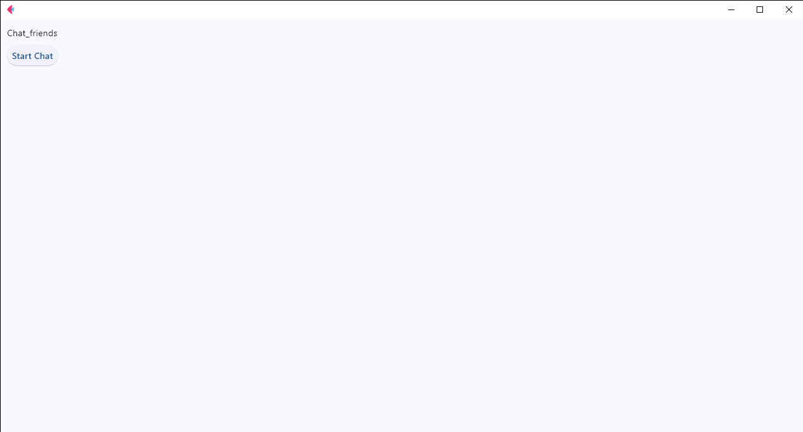

# Chat_friends 🥰

Welcome to **Chat_friends**, a simple chat application built with **Flet**! This project allows users to start a chat and send messages to each other in real time. The application is easy to use and can be run in your web browser.

## Features

- **Centralized Interface**: The first page is beautifully centered with a welcoming message.
- **Real-time Chat**: Users can send messages in real time using the pubsub system.
- **User Name Input**: On the first page, users are prompted to enter their name before starting the chat.
- **Send Messages**: Once the chat is started, users can send messages, and they will appear in real time for all users.
  
## Screenshots

Here are some images showing the layout of the application:

________________________________________

<h4 align="center">Chat_friends 🥰 🚀</h4>

<div align="center">
    <table>
        <tr>
            <td style="width: 50%; text-align: center;">
                
                <p style="margin-top: 5px;">Page_start_APP</p>
            </td>
            <td style="width: 50%; text-align: center;">
                
                <p style="margin-top: 5px;">Tela_popup_event</p>
            </td>
        </tr>
    </table>
</div>

  <br/>
  <br/>


________________________________________

<div align="center">
    <table>
        <tr>
            <td style="width: 50%; text-align: center;">
                
                <p style="margin-top: 5px;">Button_line</p>
            </td>
            <td style="width: 50%; text-align: center;">
                
                <p style="margin-top: 5px;">Controls.append_text</p>
            </td>
        </tr>
    </table>
</div>

  <br/>
  <br/>


________________________________________


<div align="center">
    <table>
        <tr>
            <td style="width: 50%; text-align: center;">
                
                <p style="margin-top: 5px;">Msg and name user</p>
            </td>
            <td style="width: 50%; text-align: center;">
                
                <p style="margin-top: 5px;">Msg_user_start_chat</p>
            </td>
        </tr>
    </table>
</div>

  <br/>
  <br/>

  ________________________________________


<div align="center">
    <table>
        <tr>
            <td style="width: 50%; text-align: center;">
                
                <p style="margin-top: 5px;">Tunnel_conumication</p>
            </td>
            <td style="width: 50%; text-align: center;">
                
                <p style="margin-top: 5px;">Tela_popup</p>
            </td>
        </tr>
    </table>
</div>

  <br/>
  <br/>


________________________________________

## Code Explanation

Here is a brief breakdown of the core parts of the code:

### 1. **Main Page Layout**

The first page is centered using the following code:

```python
pagina.vertical_alignment = "center"
pagina.horizontal_alignment = "center"
The Text widget displays the title "Welcome to Chat_friends 🥰".

2. Popup for User Name Input
When the user clicks the "Start Chat" button, a popup appears, prompting them to enter their name:

python
Copiar
Editar
popup = ft.AlertDialog(
    title=ft.Text("Welcome to chat 🤩"),
    content=ft.TextField(label="Enter your name....  ✒"),
    actions=[ft.ElevatedButton("Start Chat", on_click=start_chat)]
)
3. Starting the Chat
Once the user enters their name, they can start the chat, which changes the layout and adds the message controls:

python
Copiar
Editar
def start_chat(evento):
    popup.open = False  # Close the popup
    pagina.controls.clear()  # Clear initial screen
    pagina.add(chat)  # Add chat to page
    pagina.add(line_send)  # Add message input line
4. Sending Messages
When the user sends a message, it will be broadcast to all users in the chat using the pubsub system:

python
Copiar
Editar
def send_message(evento):
    name_user = box_name_user.value
    text_camp_msg = camp_send_msg.value
    msg = f"{name_user} : {text_camp_msg}"
    pagina.pubsub.send_all(msg)  # Send the message to all users
5. Container for the First Screen
To center the first screen elements (title and button), we use a Container:

python
Copiar
Editar
container_inicial = ft.Container(
    content=ft.Column(
        controls=[titulo, button_start],
        alignment="center",  # Vertical alignment
        horizontal_alignment="center"  # Horizontal alignment
    ),
    alignment=ft.alignment.center,
    expand=True  # Expand the container to fill the screen
)
Getting Started
To run this project locally, follow these steps:

Clone the repository to your local machine:

bash
Copiar
Editar
git clone https://github.com/your-username/chat_friends.git
Install the necessary dependencies:

bash
Copiar
Editar
pip install flet
Run the application:

bash
Copiar
Editar
python app.py
Open your browser and visit the URL shown in the terminal.

Technologies Used
Flet: A framework for building interactive web apps in Python.

Python: The main programming language used to build the app.

License
This project is licensed under the MIT License - see the LICENSE file for details.

markdown
Copiar
Editar

### Notes for your GitHub Repository:

1. Make sure to replace `https://github.com/your-username/chat_friends.git` with the actual URL of your repository.
2. Ensure you have the images (`first_screen.png`, `chat_screen.png`) in the `images` folder inside your project. If the images are named differently, update the names accordingly.
3. You can add more details about your project and improve the documentation with any other features or specific installation instructions.

This structure will help make your project well-documented and easy to understand for other developers visiting your GitHub page.


